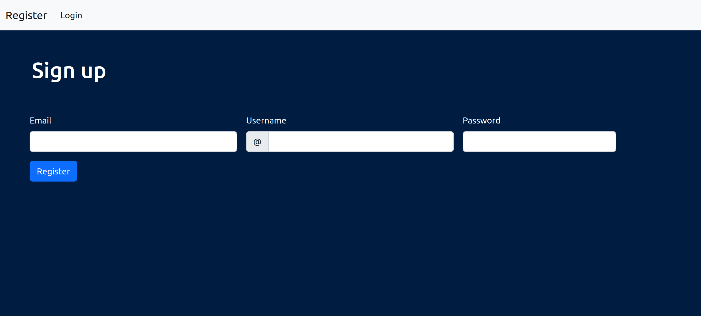
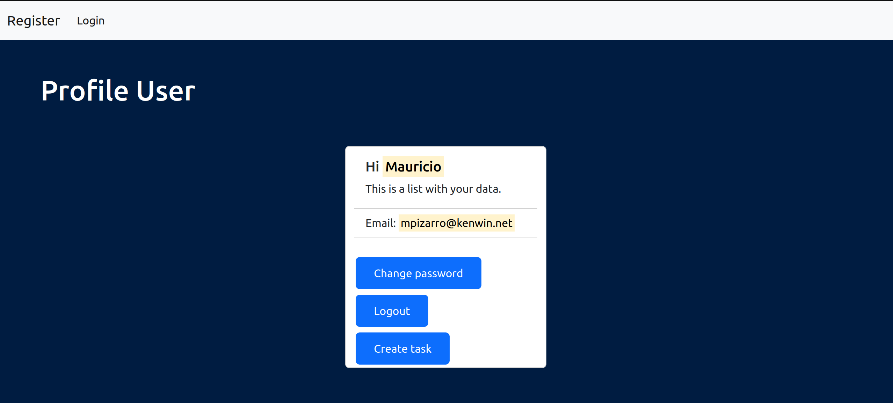
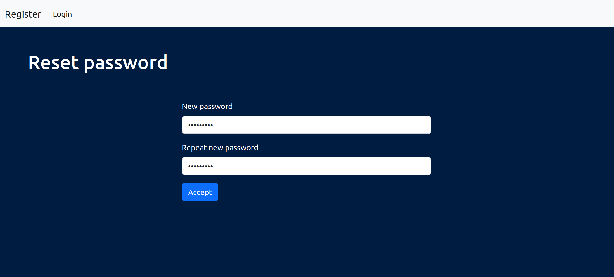

kenwin-challenge
-

# Introducción

Este repositorio contiene una aplicación en Python, usando el framework Fast Api para el desarrollo de los endpoints y Mongodb como base de datos principal. 
En esta app un usuario puede registrarse, iniciar o cerrar sesión, restablecer su password, etc.
 
Una vez que el usuario inicia sesión, puede crear tareas, listarlas y finalizar las mismas.

# Tecnologías utilizadas

- Docker
- MongoDB
- FastAPI
- Inyeccion de dependencias
- JWT
- Oauth2
- Pydantic
- Jinja2 templates
- Bootstrap
- HTML
- Pytest
- GitHub / GitHub Actions

# Instalación

1) Clonar el repositorio

            git clone https://github.com/Mauriciopizarro/kenwin-challenge.git

2) Crear el archivo env en el raiz del proyecto y configurar las siguientes variables de entorno    
  **_MONGO_INITDB_DATABASE_**= 
  **_FAST_API_PORT_**= 
  **_DATABASE_URL_**=  
  **_ACCESS_TOKEN_EXPIRES_IN_**=  
  **_JWT_ALGORITHM_**=  
 **_JWT_PRIVATE_KEY_**=  
 **_JWT_PUBLIC_KEY_**=  
 
3) Buildear del docker compose

       docker-compose build
4) Iniciar contenedores

       docker-compose up

5) Listo, la app ya está levantada en el puerto 5000 (o el puerto que hayas colocado en el env)

 

# Endpoints
                                                

## Login

En primer lugar se debe registrar un usuario (enviar en el body '**email**', '**username**' y '**password**')

`http://localhost:5000/api/v1/register`

    curl --location --request POST 'http://localhost:5000/api/v1/register' \
    --header 'Content-Type: application/json' \
    --data-raw '{
        "email": "example@mail.com",
        "username": "Name",
        "password": "Password"
    }

**Constraints**

- El email debe ser una dirección de mail válida.
- La contraseña debe contener entre 8 y 14 caracteres.

Una vez registrado, se debe iniciar con las credenciales colocadas en el register

`http://localhost:5000/api/v1/login`

    curl --location --request POST 'http://localhost:5000/api/v1/login' \
    --header 'Content-Type: application/json' \
    --data-raw '{
        "email": "your_email",
        "password": "your_password"
    }'

Al iniciar sesión, se creara un access_token, este será seteado en las cookies de las request, por lo que no será necesario colocarlo manualmente. Los demás endpoints van a requerir de estar autenticado.
 
El usuario puede cerrar sesión a través del siguiente endpoint

`http://localhost:5000/api/v1/logout`

 

Estando logueado, el usuario puede cambiar su contraseña

`http://localhost:5000/api/v1/reset_password`
 

    curl --location --request POST 'http://localhost:5000/api/v1/reset_password' \
    --header 'Content-Type: application/json' \
    --data-raw '{
        "new_password": "new_pass",
        "repeat_new_password": "repeat_new_pass"
    }'

 

## Tareas

El usuario puede crear sus propias tareas, las mismas tendrán descripción dificultad, fecha de inicio y fecha de fin, etc.

Para crear una tarea debemos estar autenticados.  

`http://localhost:5000/api/v1/create_task`

    curl --location --request POST 'http://localhost:5000/api/v1/create_task' \
    --header 'Content-Type: application/json' \
    --data-raw '{
        "description": "Alguna descripción",
        "difficult": 3
    }'

**Constraints**
- La dificultad debe ser un valor numérico entre 1 y 10, siendo 1 una tarea fácil o 10 muy difícil.
 
 

Para visualizar todas nuestras tareas, debe hacer GET al siguiente endpoint

`http://localhost:5000/api/v1/tasks`

    curl --location --request GET 'http://localhost:5000/api/v1/tasks'
 
 
Para finalizar una tarea se debe enviar por parámetro el id de la tarea, este se puede obtener haciendo un GET en el anterior endpoint.
`http://localhost:5000/api/v1/finish_task/{task_id}`

    curl --location --request POST 'http://localhost:5000/api/v1/finish_task/{task_id}'

# Front-end

Esta app incluye un frontend donde el usuario puede registrarse:

Una vez registrado, se debe iniciar sesión:

Luego de iniciar sesión con nuestras credenciales, veremos un Home de bienvenida: 

En este home tendremos algunos datos de nuestra cuenta, un access_token y los botones de cambiar contraseña y cerrar sesión.
 

Tambien es posible cambiar nuestra conseseña, para ello, hacer clic en el boton de change_password y colocar nuestra nueva contraseña y repetirla.

 
 
 
 
 

## Desarrollo

Esta app ha sido desarrollada por Mauricio Pizarro  
Email: pizarromauricio031096@gmail.com